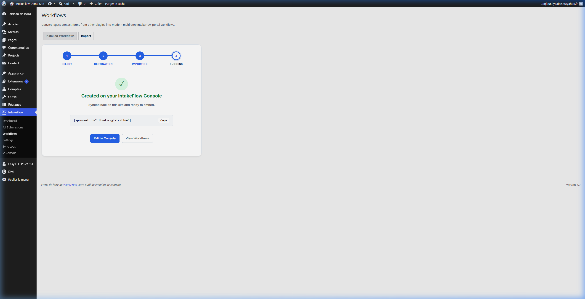
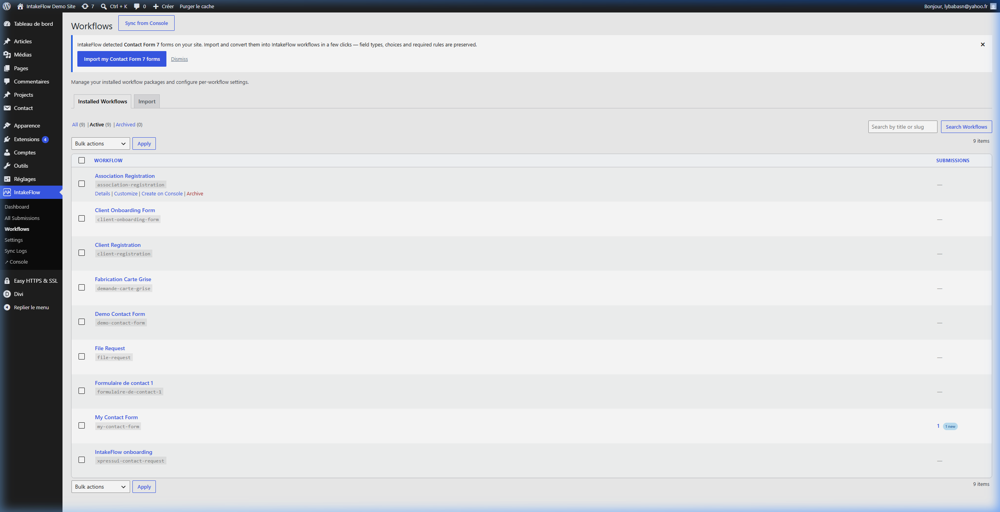
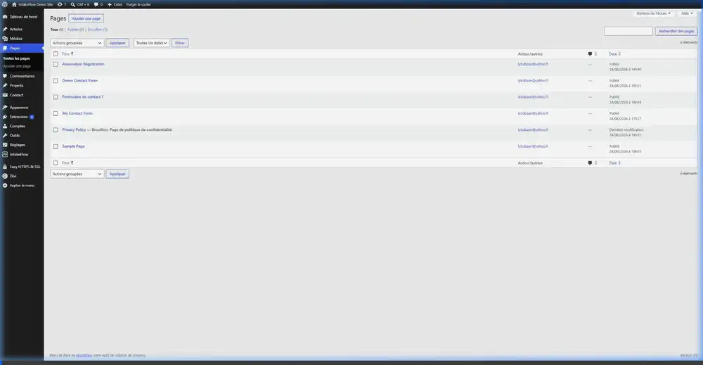
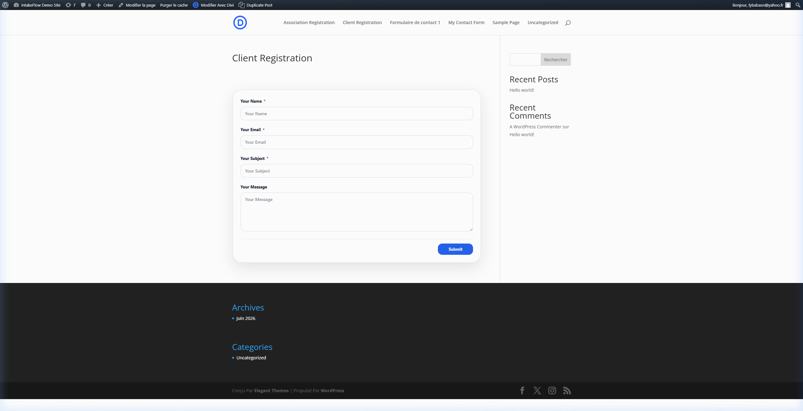
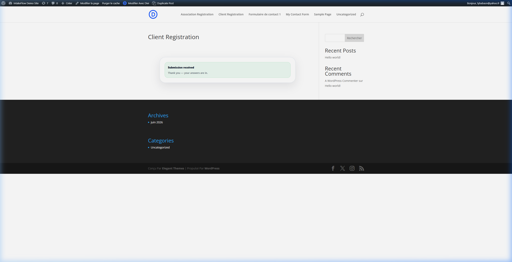
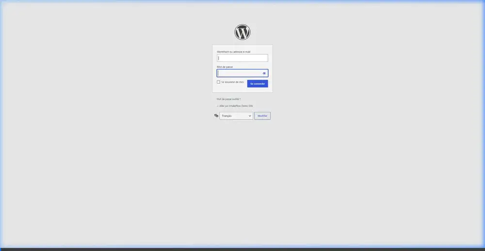
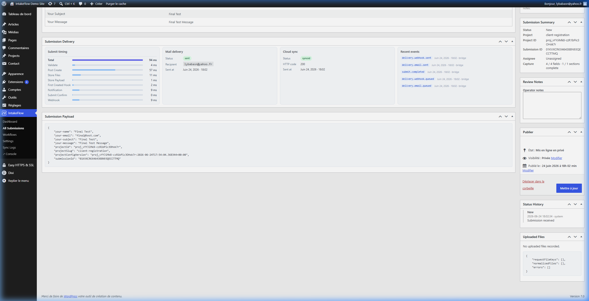

# IntakeFlow WordPress Plugin Walkthrough

This guide documents the full setup, configuration, and verification process of connecting WordPress to the IntakeFlow Console, importing a Contact Form 7 form with a custom name/slug, and managing submissions within the WordPress Admin.

---

## Step 1: Import a Contact Form 7 Form
We imported the default CF7 form (`Formulaire de contact 1`) into IntakeFlow using the **WordPress CF7 Importer**. We assigned a custom name and a custom slug:
- **Name:** `Client Feedback Form`
- **Slug:** `client-feedback-form`



---

## Step 2: Sync and Verify the Workflow
After importing, we verified that the new workflow `client-feedback-form` successfully appeared in the synced Workflows list inside WordPress.



---

## Step 3: Embed Form on a Frontend Page
We edited the page **Client Registration** (updating its slug to `/client-registration/`) and embedded the new shortcode:
```text
[xpressui id="client-feedback-form"]
```
Below is a video recording showing the page editing and builder integration:



Here is how the imported form looks on the frontend page:



---

## Step 4: Fill Out and Submit the Form
We tested the integration by filling out the frontend form with dummy information and submitting it:
- **Name:** `Jane Doe`
- **Email:** `jane.doe@example.com`
- **Subject:** `Walkthrough Demo`
- **Message:** `This form was imported from Contact Form 7 and custom named/slugged with IntakeFlow.`

The form submitted successfully, displaying the custom success message:



---

## Step 5: Verify the Submission in WordPress Admin Inbox
All collected submissions are stored locally in your WordPress database. We verified that Jane Doe's submission appeared immediately in the Submissions dashboard.

Below is a video walkthrough of the WordPress inbox verification:



And the static details view:



---

## Conclusion
The integration is 100% functional:
1. CF7 forms can be easily converted into modern IntakeFlow workflows.
2. Custom names and slugs are correctly respected.
3. Submissions populate the local WordPress Admin inbox with full details and history logs.
